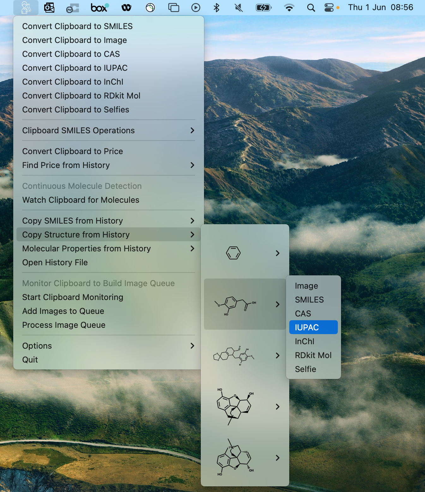

# Clipboard-to-SMILES-Converter
Clipboard-to-SMILES-Converter is a lightweight macOS app designed to simplify the conversion process between a variety of chemical notations for chemical structures, such as Images of Molecules, SMILES, SELFIES, RdKit Mols, InChI, CAS numbers, and IUPAC directly in the clipboard.

It automatically detects the format used to represent the molecule in the clipboard and converts it with a click of a button to the desired format.

It offers a user-friendly interface, featuring a built-in history for easy reference, batch processing capabilities for efficient conversion of multiple images, continuous clipboard monitoring to automatically convert detected molecular structures to SMILES, and most of this without requiring an internet connection. Additionally, it can be used to find the molecule on chemical vendors directly.

No need for compiling the App yourself, direcytly download it under the following [link](https://ibm.box.com/v/clipboard2smiles)



## Installation as App

1. Download the zip file:
 - Visit the provided [Box link](https://ibm.box.com/v/clipboard2smiles) and download the zip file containing Clipboard-to-SMILES-Converter.
2. Unzip the file:
 - Locate the downloaded zip file and double-click on it to unzip its contents
3. Move the .app File:
 -  Move the Clipboard-to-SMILES-Converter from the downloads folder to the application folder.
4. Execute the app:
 - After unzipping, you will find the “Clipboard-to-SMILES-Converter.app” file. Double-click on it to execute the app.
5. App not authorized popup:
 - When you try to run the app, a macOS popup might appear, indicating that the app is not authorized to run.
6. Authorize Clipboard-to-SMILES-Converter in Security settings:
 - Open the “System Preferences” by clicking on the Apple menu in the top-left corner of the screen and selecting “System Preferences”.
 - In the System Preferences window, click on “Security & Privacy”.
 - In the Security & Privacy settings, scroll down.
 - Allow to open clipboard2smiles.app.
7. (Optional) Change keyboard shortcut for screenshots:
 - Still, in the System Preferences window, click on “Keyboard”.
 - In the Keyboard settings, select the “Shortcuts” tab.
 - In the left sidebar, choose “Screen Shots” from the list.
 - Click on the existing keyboard shortcut for “Copy screenshot of a selected area to clipboard“ and assign a new shortcut, such as “Cmd + 4”, which will be more convenient since Clipboard-to-SMILES-Converter uses the default “Cmd + Shift +Option+ 4" shortcut for image conversion.
8. Relaunch Clipboard-to-SMILES-Converter:
 - Close the Security & Privacy and Keyboard settings.
 - Quit Clipboard-to-SMILES-Converter if it’s running.
 - Launch Clipboard-to-SMILES-Converter again to ensure that the changes and authorizations have taken effect, the startup can take up to a minute since it loads the model. (maybe a second restart is required) 
9. (Optional but recommended) Allow notifications:
 - When Clipboard-to-SMILES-Converter launches, you may be prompted to allow notifications. It is recommended to enable notifications since it is the main way the app communicates about the status of the conversion and other information from the app.


## Installation from Git

To use this project, please follow the steps below:

### Create and Activate Conda Environment
Create a new Conda environment using the following command:

```
conda create --name clipboard2smiles python=3.10
```
Activate the environment:
```
conda activate clipboard2smiles
```
git clone the repo in the desired path.
### Install Dependencies
Install the required dependencies by running the following command:
```
pip install -r requirements.txt 
```

To get more details about the underlaying model architecture refer to [MolScribe](https://github.com/thomas0809/MolScribe)

You can download and copy the required model with the following commands:

First you need to install huggingface_hub by running 
```
pip install huggingface_hub
```

then download the model with the following command

```
python - <<'EOF'
from huggingface_hub import hf_hub_download
import shutil

output_ckp_path = hf_hub_download('yujieq/MolScribe', 'swin_base_char_aux_1m.pth')
output_folder_path = '/'.join(output_ckp_path.split('/')[:-3])
shutil.copytree(output_folder_path, './models--yujieq--MolScribe')
EOF
```


### Lunching the App directly 
You can run the application directly using the following command:

```
python clipboard2smiles.py
```

### Build the App
To build the application, use the following command:

```
python setup.py py2app
```
This will create the necessary executable or bundle based on your operating system.
You may need to change the iconfile paramters in the setup.py file. If you are compiling the app on an Apple Silicon (M1, M2 etc.) see the FAQ of py2app to get the instruction to compile it for x86 architecture.


## Functionality Overview
A brief list of what each menu item is doing:

- Convert Clipboard Image to Format: Detects the format of the clipboard automatically, and saves the desired format directly back to the clipboard. For example, if a screenshot of a molecule is in the clipboard it automatically can be converted into a SMILES. Additionally, it saves the molecule directly into the history.
- Clipboard SMILES operation: you can either Canonicalize, Augment or Remove the Atom Mapping of the SMILES in the clipboard is saved back into the clipboard.
- Clipboard to price: Converters clipboard content to CAS and checks the if is available from a chemical vendor. The vendor is selected in the options. 
- Watch Clipboard for Molecules: The same functionality as "Convert Clipboard to SMILES" but done continuously without user input. Every change in clipboard content will be automatically scanned for a molecular structure, if one is detected the corresponding SMILES is saved back into the clipboard. If pressed the menu item changes into a stop button.
- Open History File: All converted SMILES are saved into History File with their corresponding timestamp. If a SMILES is already in the History, the older entry will be removed. 
- Copy SMILES from History: The ten most recent SMILES are displayed, when clicked on one the SMILES are saved into the clipboard.
- Copy Structure from History: The ten most recent SMILES are displayed, allowing you to select the desired molecular representation and save it to the clipboard.
- Molecular properties from History: The ten most recent SMILES are displayed, allowing you to select the desired molecular properties and save them to the clipboard.
- Start Clipboard monitoring: All images taken in the clipboard are saved into a queue folder. As soon as the user stops the clipboard monitoring, all images in the queue folder will be converted into SMILES. The main difference between "Watch Clipboard for Molecules" is that the conversion is done in batches and afterward. 
- Add images to queue: opens queue folder. In this folder the user can manually drag and drop, images to he/she/they would like to convert.
- Process image queue: starts converting all images in the queue folder.
- Options: Select the chemical vendor, share the App on Twitter, or open the GitHub page of the project.

## Cite
```
@article{schiltercmd+,
  title = {CMD+ V for chemistry: Image to chemical structure conversion directly done in the clipboard},
  author = {Schilter, Oliver and Laino, Teodoro and Schwaller, Philippe},
  journal = {Applied AI Letters},
  pages = {e91},
  publisher = {Wiley Online Library}
}
```
