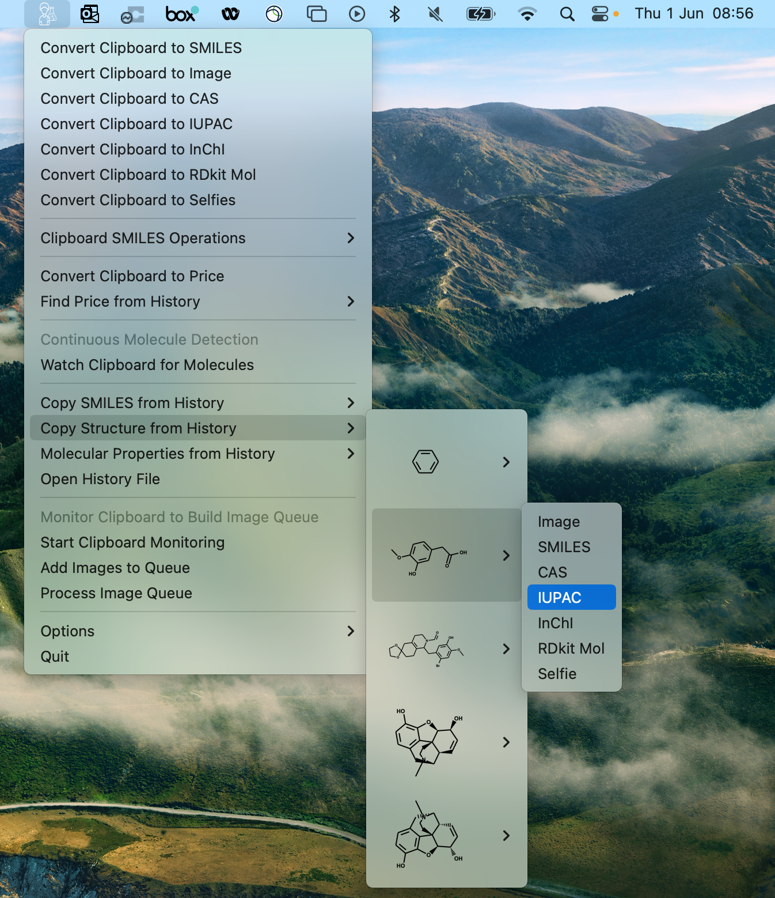

# Summary
The overall goal was to make a local MacOS app that allows the user to directly access the clipboard content and do operations on it and return the output back into the clipboard. The core functionality is to convert clipboard images of molecules, snipped with the build MacOS screenshot tool and automatically translated them in their corresponding molecular representation. We opted for one of the more popular text based chemical representation the "Simplified Molecular Input Line Entry Specification" commonly refeered as SMILES [@SMILES].

{width=35%}

The app runs exclusively in the status bar of macOS and offers user the following functionalities:
* Convert Image from the clipboard to SMILES: With Clipboard-to-SMILES-Converter, you can easily convert an image from your clipboard into SMILES notation.
* Convert SMILES from the clipboard to the Image of the molecule: It also provides the reverse functionality, allowing you to convert SMILES from the clipboard back into an image of the molecule.
* Canonical SMILES: Clipboard-to-SMILES-Converter can generate canonical SMILES from the clipboard, providing a standardized representation of chemical structures.
* Continuous monitoring of the clipboard: The app continuously monitors the clipboard, and if it detects an image, it automatically tries to convert it into SMILES and copies the SMILES automatically back to the clipboard for easy copy-pasting.
* Built-in history: Clipboard-to-SMILES-Converter keeps a history of all the converted SMILES, making it easy to access and refer back to previously converted molecules.
* Batch Processing: If you have a folder full of images, Clipboard-to-SMILES-Converter can efficiently process them all and convert them into SMILES in one go.
* Fully local and installation-free: Clipboard-to-SMILES-Converter is a fully local app that doesn’t require an internet connection or any knowledge of setting up Python environments. You can simply download it using the provided [link](https://ibm.box.com/s/quusuuuk005nccvs73gu9locenqfaf0o) and start using it right away. This allows not technical users such as Chemist to use the tool without any technical barriers.

The app status bar integration is implemented using [Rumps](https://github.com/jaredks/rumps) while the underlying machine learning model which converts the images to SMILES is [MolScribe](https://github.com/thomas0809/MolScribe) [@qian2023molscribe]. 

# Statement of need

The Clipboard-to-SMILES-Converter as the name suggests main focuses to do common operations used in a typical cheminformatic workflow directly in the clipboard. One of the most time-consuming processes is redrawing chemical structures to get the SMILES e.g. looking up the molecule's property on PubChem or finding the corresponding molecule on the vendors' website. Therefore having a tool that allows the user to convert images directly from the clipboard to the molecular representation such as SMILES in beneficial. Since SMILES can be tricky to read by humans, the SMILES to Image conversion allows the user to get a redrawn image of the SMILES. There are currently, to the best of our knowledgenon-open source,  solutions to achieve this functionality.

# State of the field

Even though image to chemical structure models are redly available (opensource as well as commercial) [@qian2023molscribe; @rajan2020decimer] the often require the user to have extensive knowledge of the e.g. Python to get set them up correctly and often rely on a command line user interface. The models which have more user-friendly web applications such as MolSribe are deployed on the web, which requires users to upload potentially confidential information as well as save the images locally first before uploading them to the Web. These free available solutions often lack the history functionality. Mathpix [@Mathpix] is a commercial solution that is the closest to the offered functionality but it requires  internet access to the image to structure connection as well as limits its free tear user to a certain number of conversions per time interval.

# Installation Guide
Refer to the readme for either, launching the app via Python, building the app, or downloading the executable app to launch it directly.

# Contribution
If you'd like to contribute code changes, you can fork the repository, make your modifications, and create a pull request to have them incorporated into the project.

If you come across any problems or issues, please open a new ticket. Please provide a concise description of the problem and, if possible, include an example code that reproduces the error. Your assistance in identifying and resolving issues is greatly appreciated.
# Acknowledgements
This publication was created as part of NCCR Catalysis (grant number 180544), a National Centre of Competence in Research funded by the Swiss National Science Foundation.

# References
